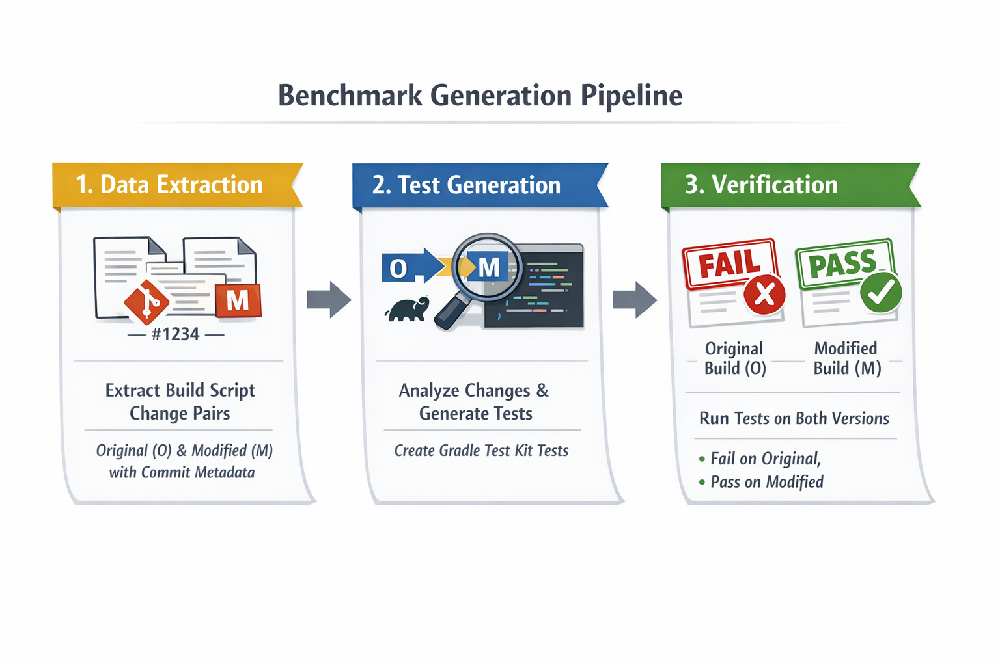

# SWE-Bench-like Benchmark Generation POC

## Overview

This POC demonstrates a verification approach for build script changes using Gradle Test Kit. Instead of simple "build failed → build passed" verification, we generate tests that:

- **Fail on the original (bad) build script** version (O)
- **Pass on the modified (fixed) build script** version (M)

## Concept

Given:
- **T**: Task description (the issue to fix)
- **O**: Original build script (broken/incorrect)
- **M**: Modified build script (fixed/correct)

We generate:
- **V**: Verification tests where `V(O) = fail` and `V(M) = pass`

## How It Works



For detailed usage instructions, command-line examples, and step-by-step guides, see [USAGE.md](USAGE.md).

## Gradle Test Kit Integration

Gradle Test Kit allows us to:
- Programmatically run Gradle builds
- Inspect build results, task outcomes, and outputs
- Test build script behavior in isolation
- Verify task configurations, dependencies, and plugins

### Example Test Structure

```java
@Test
public void testDependencyVersion() {
    BuildResult result = GradleRunner.create()
        .withProjectDir(projectDir)
        .withArguments("dependencies", "--configuration", "implementation")
        .build();
    
    // Verify specific dependency version is present
    assertTrue(result.getOutput().contains("com.example:library:2.0.0"));
}

@Test
public void testTaskExists() {
    BuildResult result = GradleRunner.create()
        .withProjectDir(projectDir)
        .withArguments("tasks", "--all")
        .build();
    
    // Verify custom task was added
    assertTrue(result.getOutput().contains("customTask"));
}
```

## Example Scenarios

### Scenario 1: Dependency Version Update
- **O**: Uses outdated library version causing build failure
- **M**: Updates to compatible version
- **V**: Test verifies correct version is resolved

### Scenario 2: Task Configuration
- **O**: Missing required task or misconfigured
- **M**: Adds/fixes task configuration
- **V**: Test verifies task exists and runs correctly

### Scenario 3: Plugin Application
- **O**: Missing plugin causing build failure
- **M**: Applies necessary plugin
- **V**: Test verifies plugin is applied and functional

## Integration with Existing Pipeline

This POC integrates with the existing task-mining pipeline:

```
mine_fixes.py → analyze_pairs.py → [NEW] extract_build_changes.py → test_generator.py → verify.py
```

## Getting Started

For detailed setup and usage instructions, see [USAGE.md](USAGE.md) - complete usage guide with examples
